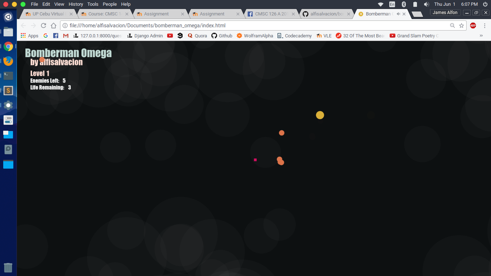
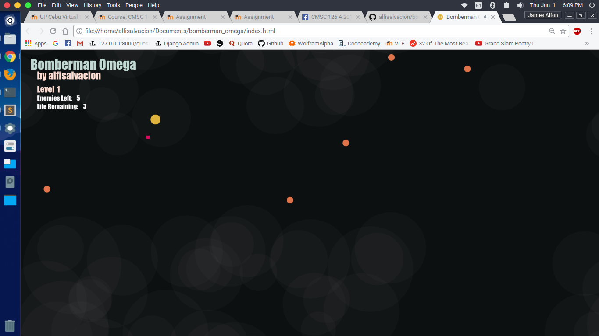
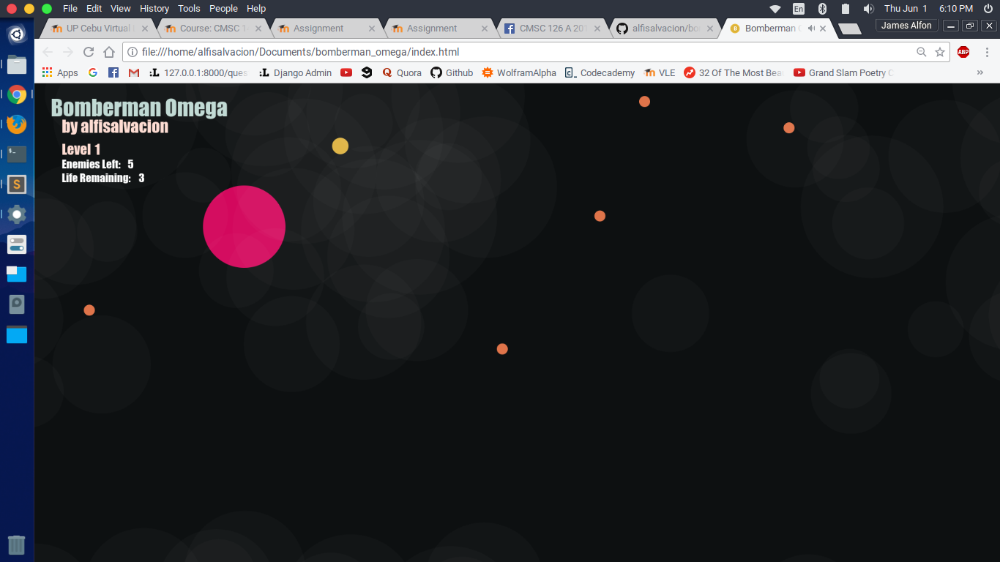

# bomberman_omega
A simple bombing game inspired by bomberman made using open web technologies like html, and javascipt and p5 js libraries.

The mechanics are simple. Your goal is to kill all enemies by planting and detonating your bomb in their faces. But it is not that simple for the enemies will chase you if ever you get near their sniffing range.

Each level further will produce additional enemies with a wider sniffing range.

## Screenshots

### Splash Screen

### Enemies with a simple AI - Get within their range, and they will chase you!

### Plant the bomb

### Detonate the bomb

